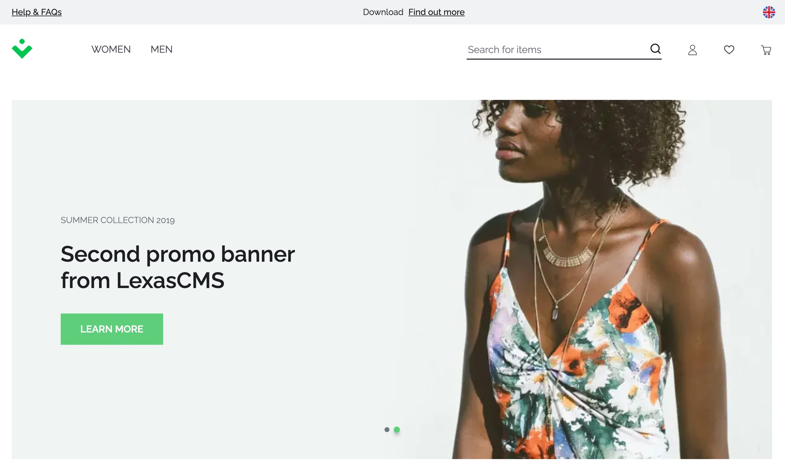

# Vue Storefront 2 Tutorial

This is the complete tutorial source code for integrating [LexasCMS](https://www.lexascms.com/) with [Vue Storefront 2](https://www.vuestorefront.io/).

  

## Tutorial

This tutorial is split into 3 parts, details of which can be found below:

- [Part 1 - Headless CMS Integration](https://www.lexascms.com/blog/integrating-a-headless-cms-with-vue-storefront-2/) [branch: [`part-1-cms-integration`](https://github.com/LexasCMS/tutorial-vuestorefront2/tree/part-1-cms-integration)]
- [Part 2 - Personalised Content](https://www.lexascms.com/blog/implementing-personalised-content-with-vue-storefront-2/) [branch: [`part-2-personalisation`](https://github.com/LexasCMS/tutorial-vuestorefront2/tree/part-2-personalisation)]
- [Part 3 - Visual Content Previews](https://www.lexascms.com/blog/visual-content-previews-with-vue-storefront-2/) [branch: [`part-3-visual-previews`](https://github.com/LexasCMS/tutorial-vuestorefront2/tree/part-3-visual-previews)]

## Live Demo

[Click here](https://lexascms-tutorial-vuestorefront2.vercel.app/) to view a live demo of this repo.

## Deploy to Vercel

Of course, you can play around with this source code by deploying it to your own Vercel account. To do so, please follow the instructions below:

1. If you don't already have one, [create a LexasCMS account](https://app.lexascms.com/signup)
2. Within LexasCMS:
    1. Create a new space using the **E-commerce Tutorial (Vue Storefront)** template
    2. Navigate to **Settings > General** and take note of your space ID
    3. Navigate to **Settings > API Keys** and create a new API key, taking note of the generated token
3. Click the below button and follow the instructions

